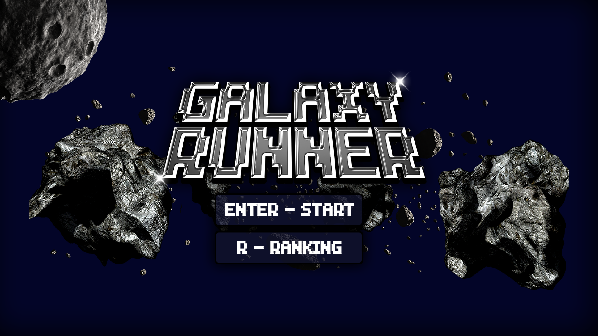
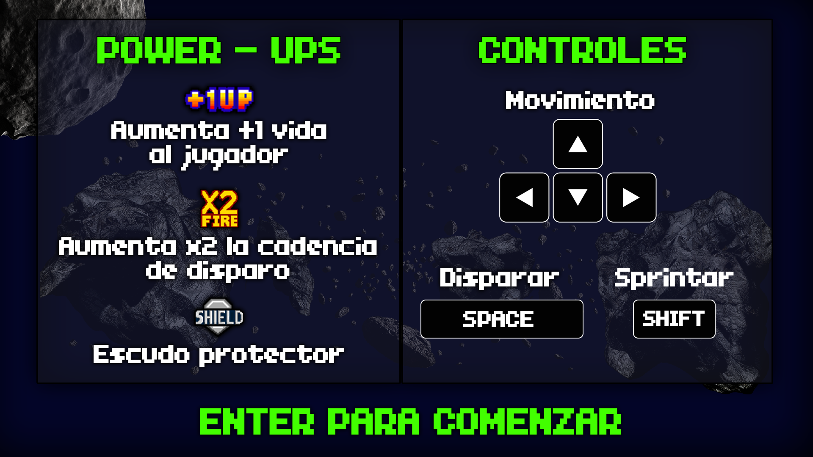

# 🚀 Galaxy Runner

> Space shooter 2D en pixel art inspirado en el *Space Invaders* de los años 80.
> Desarrollado en **Python + Pygame**, con ranking persistente en **SQLite**.


<p align="center">
  
  
</p>

---

## Índice

- [Descripción](#descripción)
- [Características](#características)
- [Stack tecnológico](#stack-tecnológico)
- [Requisitos](#requisitos)
- [Instalación y ejecución](#instalación-y-ejecución)
- [Controles](#controles)
- [Cómo se juega](#cómo-se-juega)
- [Estructura del proyecto](#estructura-del-proyecto)
- [Base de datos](#base-de-datos)
- [Generar el ejecutable](#generar-el-ejecutable)
- [Arquitectura](#arquitectura)
- [Estado y roadmap](#estado-y-roadmap)
- [Créditos](#créditos)
- [Licencia](#licencia)

---

## Descripción

El jugador controla una nave que debe **eliminar oleadas de enemigos**, esquivar
proyectiles y meteoritos, y derrotar al **jefe de cada nivel**. El juego tiene
**3 niveles** con dificultad progresiva: cada nivel sube la velocidad y la
frecuencia de disparo de los enemigos, y la vida de los jefes.

La partida termina al perder las 3 vidas (*Game Over*) o al vencer al jefe final
(*Victoria* → créditos). En ambos casos se puede guardar la puntuación con un
nombre y consultar el **TOP 10** histórico.

## Características

- 🎯 **3 niveles** con dificultad progresiva y un **jefe distinto por nivel**.
- 🖼️ **3 escenarios / ambientaciones** en pixel art.
- 👾 Enemigos con **movimiento errático** y disparo con *cooldown* aleatorio.
- ☄️ **Meteoritos** con colisión y rotación.
- 🔋 **Power-ups**: vida extra, disparo rápido y escudo.
- ⚡ **Sprint** de la nave (impulso temporal con enfriamiento).
- 🏆 **Ranking TOP 10** persistente en base de datos SQLite.
- ❤️ Sistema de **vidas** y **puntuación**.
- 🔊 **Música y efectos de sonido** contextuales (menú, combate, jefes) con
  transiciones *fade in / fade out*.
- 🖥️ Ventana **redimensionable** (resolución virtual 1280×720 escalada).

## Stack tecnológico

| Componente        | Tecnología                                   |
|-------------------|----------------------------------------------|
| Lenguaje          | Python 3.10+                                  |
| Motor de juego    | [Pygame](https://www.pygame.org/) 2.5        |
| Persistencia      | SQLite 3 (módulo `sqlite3` de la stdlib)     |
| Audio             | `pygame.mixer` (MP3)                          |
| Empaquetado       | PyInstaller (build de escritorio)            |
| Control de versiones | Git + GitHub (flujo de *feature branches* y Pull Requests) |

## Requisitos

- **Python 3.10 o superior**
- **pip**
- En Linux puede hacer falta instalar SDL2 a nivel de sistema (Pygame suele traer
  todo empaquetado en su *wheel*).

## Instalación y ejecución

```bash
# 1. Clonar el repositorio
git clone https://github.com/silvanagarcia/galaxy_runner.git
cd galaxy_runner

# 2. (Recomendado) crear un entorno virtual
python -m venv .venv
source .venv/bin/activate        # Windows: .venv\Scripts\activate

# 3. Instalar dependencias
pip install -r requirements.txt

# 4. Ejecutar
python src/main.py
```

> La base de datos `src/db/galaxy.db` **se crea automáticamente** la primera vez
> que se ejecuta el juego. No está versionada a propósito.

## Controles

| Tecla                  | Acción                                  |
|------------------------|-----------------------------------------|
| `←` `→` `↑` `↓` / `WASD` | Mover la nave                          |
| `Shift` (izq.)         | Sprint (impulso temporal)               |
| `Espacio`              | Disparar                                |
| `R`                    | Ver el ranking (desde el menú / juego)  |
| `Enter`                | Confirmar / avanzar de pantalla         |
| `Esc`                  | Volver al menú / salir                  |

## Cómo se juega

**Progresión de niveles**

| Nivel | Ambientación            | Enemigos para invocar al jefe | Jefe               |
|-------|-------------------------|-------------------------------|--------------------|
| 1     | Base                    | 30                            | Jefe 1             |
| 2     | Velocidad aumentada     | 50                            | Jefe 2             |
| 3     | Máxima dificultad       | 80                            | Jefe final         |

Al derrotar al jefe de un nivel se pasa al siguiente. Vencer al Jefe 3 completa
el juego.

**Power-ups**

| Power-up        | Efecto                                            |
|-----------------|--------------------------------------------------|
| ❤️ Vida         | Recupera una vida                                 |
| ⚡ Disparo rápido | Aumenta la cadencia de disparo por unos segundos |
| 🛡️ Escudo       | Bloquea daño temporalmente (aparece cada cierto número de bajas, máx. 2 por nivel) |

**Puntuación**

| Objetivo    | Puntos |
|-------------|--------|
| Enemigo     | 20     |
| Meteorito   | 50     |
| Jefe 1      | 100    |
| Jefe 2      | 200    |
| Jefe 3      | 300    |

## Estructura del proyecto

```
galaxy_runner/
├── src/                        # Código fuente (todo el juego)
│   ├── main.py                 # Punto de entrada: bucle principal y máquina de estados
│   ├── constants/
│   │   └── config.py           # Rutas, resolución, colores, balance del juego
│   ├── scenes/                 # Pantallas del juego (una clase por escena)
│   │   ├── start_menu.py       # Menú de inicio (2 pantallas)
│   │   ├── game_scene.py       # Gameplay: entidades, colisiones, niveles, jefes
│   │   ├── game_over_scene.py  # Game Over + carga de nombre
│   │   ├── leaderboard_scene.py# Ranking TOP 10
│   │   ├── credits_scene.py    # Créditos con scroll
│   │   └── options_scene.py    # Opciones (placeholder)
│   ├── entities/               # Entidades del juego (lógica + render)
│   │   ├── player.py           # Nave del jugador
│   │   ├── enemigos.py         # Enemigos
│   │   ├── boss.py             # Jefes (uno por nivel)
│   │   ├── meteorito.py        # Meteoritos
│   │   ├── proyectiles.py      # Proyectiles (jugador / enemigo / jefe)
│   │   ├── powerup.py          # Power-ups
│   │   └── explosiones.py      # Efecto de explosión
│   ├── service/                # Servicios transversales
│   │   ├── audio_manager.py    # Carga y reproducción de música y SFX
│   │   └── background_animation.py  # Animación de fondo (opcional)
│   ├── UI/                     # Utilidades de interfaz
│   │   ├── ui.py               # Carga de fuentes / imágenes, constantes de UI
│   │   └── intro_screen.py     # Pantallas de introducción de nivel / jefe
│   ├── db/
│   │   └── db_manager.py       # Clase Database: acceso a SQLite
│   └── assets/                 # Recursos del juego
│       ├── images/             # Sprites y fondos
│       └── sounds/
│           ├── music/          # Música (menú, combate, jefes)
│           └── sfx/            # Efectos de sonido
├── docs/                       # Documentación
│   ├── ARQUITECTURA.md         # Diseño técnico y flujo de estados
│   ├── ANALISIS-Y-MEJORAS.md   # Estado del repo y mejoras propuestas
│   ├── documento-diseno.md     # Documento de diseño del juego
│   ├── CREDITOS.md             # Autoría y recursos
│   └── screenshots/            # Capturas para el README
├── build/                      # Configuración de empaquetado
│   ├── GalaxyRunner.spec       # Spec de PyInstaller
│   ├── build.bat               # Script de build (Windows)
│   └── logo.ico                # Icono de la aplicación
├── requirements.txt
├── LICENSE
├── CHANGELOG.md
└── README.md
```

> **Nota sobre recursos opcionales:** el juego busca una fuente en
> `src/assets/fonts/04B_11__.TTF` y frames de animación en
> `src/assets/backgrounds/`. Si no están, usa *fallbacks* (fuente por defecto de
> Pygame y fondo estático) sin fallar.

## Base de datos

SQLite, dos tablas. El esquema se crea solo al iniciar (`Database._create_tables`).

```sql
CREATE TABLE players (
    id         INTEGER PRIMARY KEY AUTOINCREMENT,
    name       TEXT NOT NULL UNIQUE,
    created_at TIMESTAMP DEFAULT CURRENT_TIMESTAMP
);

CREATE TABLE scores (
    id         INTEGER PRIMARY KEY AUTOINCREMENT,
    player_id  INTEGER NOT NULL REFERENCES players(id),
    score      INTEGER NOT NULL,
    level      INTEGER NOT NULL,
    created_at TIMESTAMP DEFAULT CURRENT_TIMESTAMP
);

CREATE INDEX idx_scores_score ON scores(score DESC);
```

El ranking (`get_top_scores`) hace `JOIN` entre `scores` y `players` ordenando por
`score DESC` y limitando a 10.

## Generar el ejecutable

El *build* de escritorio se hace con **PyInstaller**. Los artefactos generados
(`build/`, `dist/`) **no se versionan**.

```bash
pip install pyinstaller
pyinstaller build/GalaxyRunner.spec
```

> ⚠️ Los scripts de `build/` fueron escritos para la estructura anterior
> (`Code/`). Están pendientes de actualizar a `src/` — ver
> [CHANGELOG.md](CHANGELOG.md) y [docs/ARQUITECTURA.md](docs/ARQUITECTURA.md).

## Arquitectura

Ver **[docs/ARQUITECTURA.md](docs/ARQUITECTURA.md)** para:

- la máquina de estados del juego (`menu → playing → game_over / victory → credits`),
- el patrón *scene* y el ciclo `handle_event → update(dt) → draw`,
- el modelo de entidades y la detección de colisiones,
- el sistema de audio contextual,
- la capa de acceso a datos.

## Estado y roadmap

**Funciona hoy:** menú, 3 niveles con jefes, power-ups, ranking SQLite, audio,
créditos, ventana redimensionable.

**Pendiente / ideas** (análisis completo en [docs/ANALISIS-Y-MEJORAS.md](docs/ANALISIS-Y-MEJORAS.md)):

- [ ] Actualizar los scripts de `build/` a la estructura `src/`.
- [ ] Implementar la pantalla de **Opciones** (hoy es un *placeholder*).
- [ ] Unificar la configuración: hoy conviven `constants/config.py` y `UI/ui.py`.
- [ ] Incluir la fuente `04B_11__.TTF` o cambiar a una fuente con licencia libre.
- [ ] Añadir *tests* y un flujo de CI en GitHub Actions.
- [ ] Evaluar Git LFS para los MP3 de música.

## Créditos

- **Dirección:** Silvana Garcia
- **Programación:** Martín López · Ivar Sosa
- **Agradecimientos:** ITES — profesores de Desarrollo de Software

Detalle de recursos (sprites, audio, fuente) en
[docs/CREDITOS.md](docs/CREDITOS.md).

## Licencia

Código bajo licencia **MIT** — ver [LICENSE](LICENSE).
Los recursos artísticos pueden tener licencias propias de sus autores.
